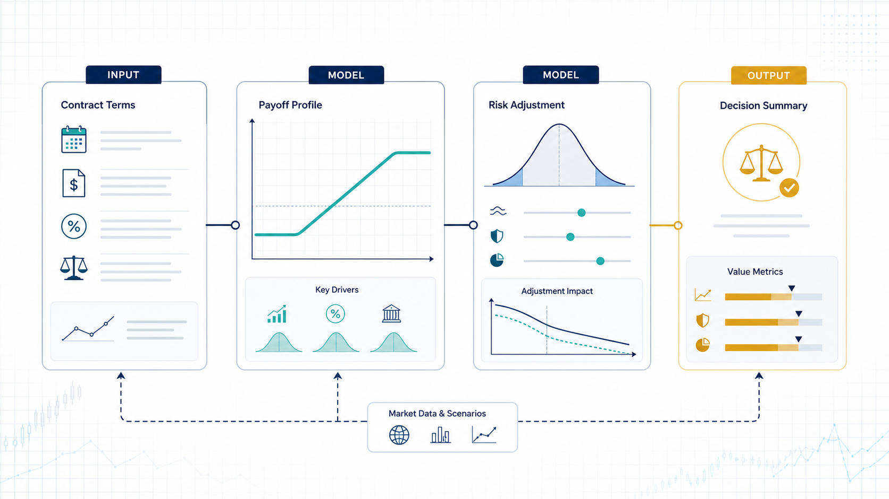

# Bank Payoff Solution

    

  <strong>Notebook-based payoff modeling for structured banking scenarios.</strong>

  

The overview figure frames the repository as a small payoff-analysis workflow: assumptions enter the notebook model, experiments produce payoff surfaces, and report artifacts capture the final interpretation.

## Overview

Bank Payoff Solution organizes notebook and report artifacts for studying parameterized payoff surfaces, kernelized response behavior, and scenario-level result interpretation. It is best used as a reproducible research workspace: open the notebooks, adjust the payoff parameters, and compare the exported reports.

## What Is Included

- `one demo- {kernel5, a=0.1,b=0.5,d=5}.nb`: worked Mathematica notebook for the reference demo case.
- `XinyuanSong.nb`: exploratory notebook for payoff derivations and parameter checks.
- `model 9.11.22.pdf`: static model write-up used as the main reference document.
- `results.docx`: saved result notes for comparison and reporting.

## Quick Start

1. `git clone git@github.com:Hik289/bank-pay-off-solution.git`
2. Open the `.nb` notebooks in Wolfram Mathematica.
3. Use the PDF and DOCX files as reference outputs when checking new parameter settings.

## Suggested Workflow

1. Start with the smallest runnable script or notebook listed above.
2. Keep raw data paths and credentials outside the repository.
3. Save generated figures, tables, and reports under the existing result folders.
4. When an experiment becomes stable, record the exact data window, parameters, and command used to reproduce it.

## Repository Map

- `assets/readme-figure.png`: README overview figure.
- Project scripts and notebooks: core research entry points.
- Result or report folders: generated artifacts used for analysis and review.

## Paper or Reference

No external paper link is currently attached to this project. For now, the code, notebooks, and notes in this repository are the primary reference artifact.

## License

No explicit license file is included yet. Add one before public reuse, redistribution, or package release.

## Maintenance Notes

- Add a pinned environment file if this project is prepared for external installation.
- Keep large datasets outside Git and document where each script expects them locally.
- Prefer small, named experiment outputs over overwriting shared result files.
